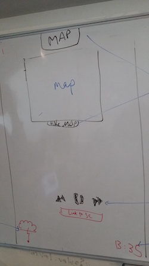

## CloudSound

## What?

Pathetic fallacy... 

>...is a literary device wherein the author attributes human emotions and traits to nature or inanimate objects. For example, the following descriptions refer to weather and how it affects the mood, which can add atmosphere to a story: smiling skies, somber clouds, angry storm, or bitter winter.

We want give the user a cathartic synergy of weather and emotion through CloudSound - a mobile-first website that gives you a weather-based playlist for the location you choose.

## Why?

We believe in the importance
There doesn't seem to currently be anything offering this capability and it could be a useful tool for getting you in the right mood for what's going on outside.

## How?

We are going to use api requests from Soundcloud, Google Maps and the Open Weather Map to "GET" data for our site

The user will be able to specify the location they would like to get a recommended playlist for
The first prototype will take in the users input for their city (eg. London)
(we could also use their current location if they have their geo location switched on)

This will then be sent to Open Weather Map which will send back the weather id. (eg. 521 = raining)

The id will be linked to a number of tags which will then be sent to Soundcloud which will send us a track based on the sent tags.

